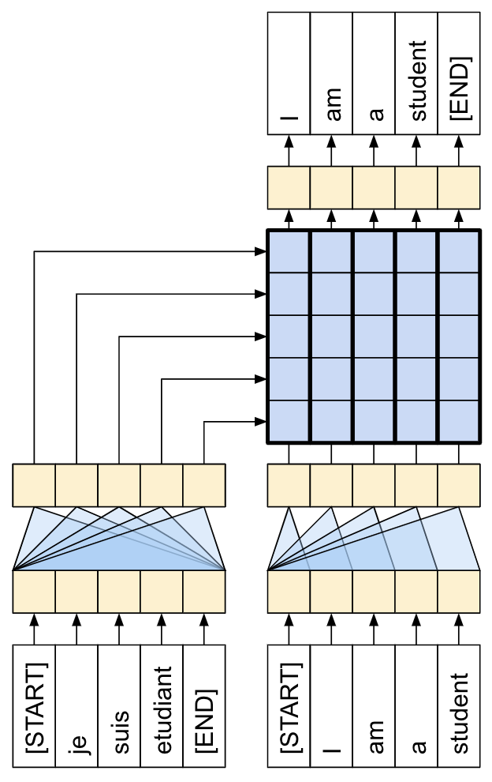
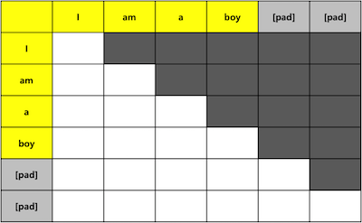
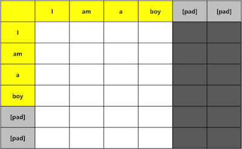

# :fire: PyTorch Transformer

This is my implementation of the widely known Transformer architecture from the paper [Attention is All You Need](https://arxiv.org/abs/1706.03762). Training was done on the [Multi30k dataset](https://github.com/multi30k/dataset), which provides 31,014 instances of images and corresponding German-English descriptions. 

Although the intention is to reproduce the original paper's implementation, this version may include minor differences. Please feel free to raise issues if you find that improvements could be made in any way.

## :electric_plug: The Transformer Architecture


```python
class Transformer(nn.Module):
    def __init__(self, src_vocab, tgt_vocab, d_model, max_len, n_heads, d_ff, N, drop_prob):
        super(Transformer, self).__init__()
        self.encoder = Encoder(src_vocab, d_model, max_len, n_heads, d_ff, N, drop_prob)
        self.decoder = Decoder(tgt_vocab, d_model, max_len, n_heads, d_ff, N, drop_prob)
        self.linear = nn.Linear(d_model, tgt_vocab)

    def forward(self, src, tgt):
        src_mask = self.make_src_mask(src)
        tgt_mask = self.make_tgt_mask(tgt)
        src_tgt_mask = self.make_src_tgt_mask(src, tgt)

        e_output = self.encoder(src, src_mask)
        d_output = self.decoder(tgt, e_output, tgt_mask, src_tgt_mask)
        output = self.linear(d_output)

        return output
```

### The Encoder Module

```python
class EncoderBlock(nn.Module):
    def __init__(self, d_model, n_heads, d_ff, drop_prob):
        super(EncoderBlock, self).__init__()
        self.multihead_attention = MultiHeadAttention(d_model, n_heads)
        self.feedforward = FeedForward(d_model, d_ff)
        self.layernorm1 = LayerNorm(d_model)
        self.dropout1 = nn.Dropout(p=drop_prob)
        self.layernorm2 = LayerNorm(d_model)
        self.dropout2 = nn.Dropout(p=drop_prob)
    
    def forward(self, input, mask):
        output = self.multihead_attention(input, input, input, mask)
        output = self.dropout1(output)
        output = input + output
        output = self.layernorm1(output)

        output2 = self.feedforward(output)
        output2 = self.dropout2(output)
        output2 = output + output2
        output2 = self.layernorm2(output2)

        return output2
```

### The Decoder Module

```python
class DecoderBlock(nn.Module):
    def __init__(self, d_model, n_heads, d_ff, drop_prob):
        super(DecoderBlock, self).__init__()
        self.multihead_attention1 = MultiHeadAttention(d_model, n_heads)
        self.multihead_attention2 = MultiHeadAttention(d_model, n_heads)
        self.feedforward = FeedForward(d_model, d_ff)
        self.layernorm1 = LayerNorm(d_model)
        self.dropout1 = nn.Dropout(p=drop_prob)
        self.layernorm2 = LayerNorm(d_model)
        self.dropout2 = nn.Dropout(p=drop_prob)
        self.layernorm3 = LayerNorm(d_model)
        self.dropout3 = nn.Dropout(p=drop_prob)

    def forward(self, input, e_output, tgt_mask, src_tgt_mask):
        output = self.multihead_attention1(input, input, input, tgt_mask)
        output = self.dropout1(output)
        output = input + output
        output = self.layernorm1(output)

        output2 = self.multihead_attention2(e_output, e_output, output, src_tgt_mask)
        output2 = self.dropout2(output2)
        output2 = output + output2
        output2 = self.layernorm2(output2)

        output3 = self.feedforward(output2)
        output3 = self.dropout3(output3)
        output3 = output2 + output3
        output3 = self.layernorm3(output3)

        return output3
```

### Self Attention



```python
class SelfAttention(nn.Module):
    def __init__(self):
        super(SelfAttention, self).__init__()

    def forward(self, queries, keys, values, mask=None):
        d_k = keys.shape[-1]
        scores = torch.matmul(queries, torch.transpose(keys, -2, -1))
        scores = scores / math.sqrt(d_k)
        if mask is not None:
            scores = scores.masked_fill_(mask==0, -1e9)
        scores = F.softmax(scores, dim=-1)
        output = torch.matmul(scores, values)
        return output
```

### Multihead Attention

```python
class MultiHeadAttention(nn.Module):
    def __init__(self, d_model=512, n_heads=8):
        super(MultiHeadAttention, self).__init__()

        self.d_model = d_model
        self.n_heads = n_heads
        self.d_k = d_model // n_heads
        
        assert (self.d_k * n_heads == d_model)

        self.v_linear = nn.Linear(self.d_model, self.d_model)
        self.k_linear = nn.Linear(self.d_model, self.d_model)
        self.q_linear = nn.Linear(self.d_model, self.d_model)
        self.out_linear = nn.Linear(self.d_model, self.d_model)
        self.self_attention = SelfAttention()

    def forward(self, values, keys, queries, mask=None):
        n_batch = queries.shape[0]

        queries = self.q_linear(queries).view(n_batch, -1, self.n_heads, self.d_k)
        keys    = self.k_linear(keys).view(n_batch, -1, self.n_heads, self.d_k)
        values  = self.v_linear(values).view(n_batch, -1, self.n_heads, self.d_k)

        queries = queries.transpose(1,2)
        keys    = keys.transpose(1,2)
        values  = values.transpose(1,2)

        scores = self.self_attention(queries, keys, values, mask=mask)
        scores = scores.transpose(1,2)
        concat = scores.contiguous().view(n_batch, -1, self.d_model)
        output = self.out_linear(concat)

        return 
```

### Masking

Sequential Masking



Pad Masking



```python
def make_pad_mask(self, query, key, pad_idx=1):
    query_seq_len, key_seq_len = query.size(1), key.size(1)

    key_mask = key.ne(pad_idx).unsqueeze(1).unsqueeze(2)
    key_mask = key_mask.repeat(1, 1, query_seq_len, 1)

    query_mask = query.ne(pad_idx).unsqueeze(1).unsqueeze(3)
    query_mask = query_mask.repeat(1, 1, 1, key_seq_len) 

    mask = key_mask & query_mask
    mask.requires_grad = False

    return mask

def make_seq_mask(query):
    seq_len = query.size(1)
    mask = torch.tensor(np.tril(np.ones((1, seq_len, seq_len)), k=0).astype('uint8'), \
           device=query.device).long()
    mask.requires_grad = False
    return mask

def make_src_mask(src):
    return make_pad_mask(src, src)

def make_tgt_mask(tgt):
    pad_mask = make_pad_mask(tgt, tgt)
    seq_mask = make_seq_mask(tgt)
    mask = pad_mask & seq_mask
    return mask

def make_src_tgt_mask(ssrc, tgt):
    return make_pad_mask(tgt, src)
```

## :chart_with_downwards_trend: Train & Validation Loss

The following is the cross entropy loss of train and test runs on 100 epoch test run. The minimum evaluation loss is recorded at 0.0733. BLEU scoring was not implemented in this case.

